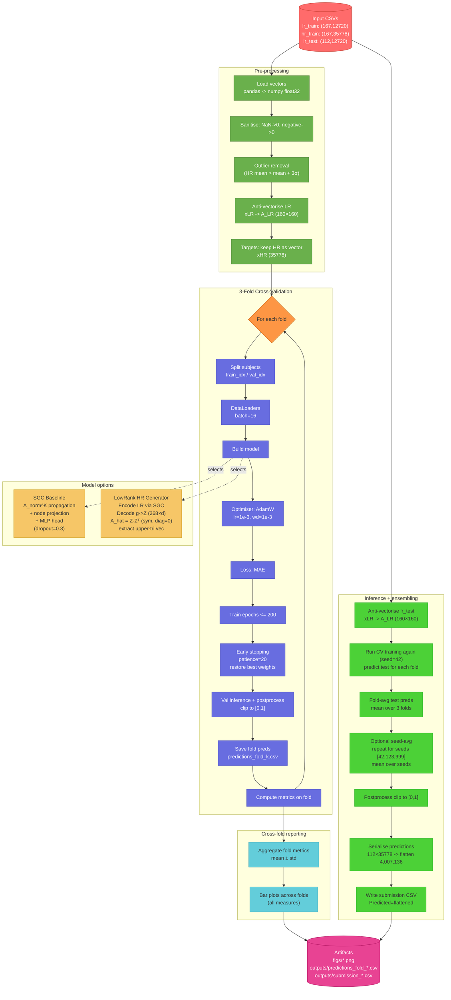

# DGL2026 Group Coursework — Brain Graph Super-Resolution

Predict **high-resolution (HR) brain connectivity graphs** from paired **low-resolution (LR)** inputs using graph neural networks. The challenge follows a Kaggle-style evaluation: models are trained on `lr_train` / `hr_train` and must generate predictions for `lr_test`.

---

## Table of Contents

1. [Problem Overview](#problem-overview)
2. [Dataset](#dataset)
3. [Project Structure](#project-structure)
4. [Models](#models)
5. [Pipeline](#pipeline)
6. [Evaluation Metrics](#evaluation-metrics)
7. [Setup](#setup)
8. [Running the Notebooks](#running-the-notebooks)
9. [Outputs](#outputs)

---

## Problem Overview

Each brain connectivity graph is stored as a flattened upper-triangular edge-weight vector. The goal is to super-resolve a 160-node LR graph (12 720 edges) into a 268-node HR graph (35 778 edges) per subject.

---

## Dataset

| File | Shape | Description |
|---|---|---|
| `data/lr_train.csv` | 167 × 12 720 | LR edge vectors, training subjects |
| `data/hr_train.csv` | 167 × 35 778 | HR edge vectors, training subjects |
| `data/lr_test.csv` | 112 × 12 720 | LR edge vectors, test subjects |

Preprocessing steps applied to all splits:
- Replace NaN and negative values with 0
- Remove outlier training subjects (HR mean > mean + 3σ)
- Anti-vectorise LR vectors → adjacency matrices of shape 160 × 160

---

## Project Structure

```
.
├── baseline.ipynb          # SGC baseline model + 3-fold CV
├── improvement.ipynb       # Improved SGC + LowRank generator + ensembling
├── DGL_Dataset_EDA.ipynb   # Exploratory data analysis
├── requirements.txt
├── data/
│   ├── hr_train.csv
│   ├── lr_train.csv
│   └── lr_test.csv
├── figs/                   # Saved bar-charts and plots
├── outputs/                # Per-fold prediction CSVs and submission files
├── report_artifacts/
│   └── pipeline_flowchart.mmd
└── utils/
    ├── MatrixVectorizer.py  # Vectorise / anti-vectorise adjacency matrices
    ├── plot_chart.py        # Bar-chart helpers
    ├── reproducibility.py   # Seed + device setup
    └── training.py          # compute_metrics (MAE, PCC, JSD, graph centralities)
```

---

## Models

### Baseline — SGC (`baseline.ipynb`)

Simple Graph Convolution (SGC) used as a direct regression head:

1. Normalise the LR adjacency matrix: $\hat{A} = D^{-1/2}(A+I)D^{-1/2}$
2. K-step propagation: $X' = \hat{A}^K X$ &nbsp;(K = 2)
3. Linear node projection → flatten → MLP → 35 778-dim HR vector

Key hyperparameters: `HIDDEN_DIM=128`, `MLP_DIM=256`, `EPOCHS=200`, `LR=1e-3`, `BATCH_SIZE=16`.

---

### Improved SGC (`improvement.ipynb` — Phase 1)

Enhancements on top of the baseline:

| Change | Detail |
|---|---|
| Sigmoid output | Constrains predictions to [0, 1] |
| Dropout (p = 0.3) | Applied inside MLP |
| AdamW | Weight decay = 1e-3 |
| Early stopping | Patience = 20 epochs, best-weight restore |
| Flexible loss | L1 (MAE) or Weighted-MAE (`ALPHA=5.0`) |

---

### Low-Rank HR Generator (`improvement.ipynb` — Phase 2)

An alternative decoder that predicts the HR adjacency matrix via low-rank factorisation:

1. Encode LR adjacency with SGC propagation + mean-pool → graph vector $g$
2. Decode $g$ → node embeddings $Z \in \mathbb{R}^{B \times 268 \times d}$
3. $\hat{A} = \sigma(Z Z^\top)$, symmetric, zero diagonal, upper-triangular vectorised

Switch with `MODEL_TYPE = "sgc"` or `"lowrank"` and `LOWRANK_DIM = 32`.

---

### Ensembling (`improvement.ipynb` — Phase 3)

- **Fold averaging**: mean predictions across 3 CV folds (seed = 42)
- **Seed averaging**: optionally repeat for seeds `[42, 123, 999]` and average (`RUN_SEED_AVG = True`)
- Final predictions are clipped to [0, 1] and serialised to a flat submission CSV

---

## Pipeline



---

## Evaluation Metrics

All metrics are computed per-subject via `utils/training.compute_metrics` and averaged:

| Metric | Description |
|---|---|
| **MAE** | Mean Absolute Error on raw edge weights |
| **PCC** | Pearson Correlation Coefficient |
| **JSD** | Jensen–Shannon Divergence |
| **MAE(BC)** | MAE of betweenness centrality |
| **MAE(EC)** | MAE of eigenvector centrality |
| **MAE(PC)** | MAE of PageRank centrality |
| **MAE(CC)** | MAE of closeness centrality |
| **MAE(DC)** | MAE of degree centrality |

---

## Setup

```bash
# 1. Create and activate virtual environment
python -m venv .venv
source .venv/bin/activate

# 2. Install dependencies
pip install -r requirements.txt
pip install torch==2.2.2 torchvision==0.17.2 torchaudio==2.2.2 \
    --index-url https://download.pytorch.org/whl/cu118
pip install torch_geometric accelerate -U
```

> GPU (CUDA 11.8) is recommended but the code falls back to CPU automatically.

---

## Running the Notebooks

| Notebook | Purpose |
|---|---|
| `DGL_Dataset_EDA.ipynb` | Exploratory analysis of LR/HR distributions |
| `baseline.ipynb` | Train & evaluate the SGC baseline |
| `improvement.ipynb` | Train improved SGC / LowRank model, run ensembling, generate submission |

Run all cells top-to-bottom. Intermediate predictions are saved to `outputs/` after each fold.

---

## Outputs

| Path | Contents |
|---|---|
| `outputs/predictions_fold_k.csv` | Validation predictions for fold k |
| `outputs/submission_*.csv` | Final Kaggle submission (`ID`, `Predicted`) |
| `figs/*.png` | Bar charts of per-fold metrics |

